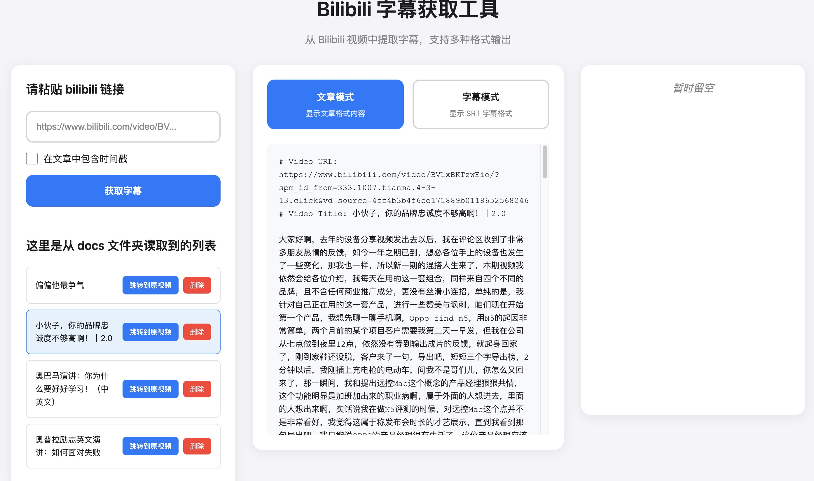

# Bilibili字幕获取服务

用于获取Bilibili视频的字幕内容，本地保存，并支持 web 展示，当然了，全程 vibe coding


## 功能特性

- 支持BV号和AV号格式的视频链接
- 支持稍后再看页面的视频链接
- 自动获取可用字幕语言列表
- 支持多种输出格式（TXT、SRT、JSON、文章格式）
- 支持指定字幕语言
- 支持命令行和Web界面两种使用方式
- 自动保存到本地文件夹

## 环境要求

- Python 3.10+
- uv (Python包管理器)

## 安装配置

### 1. 安装uv

如果您还没有安装uv，请先安装：

```bash
# macOS和Linux
curl -LsSf https://astral.sh/uv/install.sh | sh

# Windows (PowerShell)
powershell -c "irm https://astral.sh/uv/install.sh | iex"

# 或者使用pip安装
pip install uv
```

### 2. 项目安装

#### 方法一：使用安装脚本（推荐）

```bash
chmod +x install.sh
./install.sh
```

#### 方法二：手动安装

```bash
# 创建虚拟环境（自动检测合适的Python版本）
uv venv .venv

# 或指定具体版本
uv venv .venv --python python3.10
uv venv .venv --python python3.11
uv venv .venv --python python3.12

# 安装项目依赖
uv pip install -e .

# 安装开发依赖（可选）
uv pip install -e ".[dev]"
```

### 3. 配置Cookie（必需）

由于B站政策变化，现在获取字幕需要登录状态。请先配置Cookie信息。

#### 🚀 快速配置

1. **复制配置文件**
   ```bash
   cp .env.example .env
   ```

2. **获取Cookie**
   - 登录 [bilibili.com](https://www.bilibili.com)
   - 打开浏览器开发者工具（按F12）
   - 切换到 **Application（应用程序）** 标签页
   - 在左侧找到 **Cookies** 下的 `https://www.bilibili.com`
   - 找到 `SESSDATA`、`bili_jct`、`buvid3` 等字段
   - 复制对应的Cookie值

3. **编辑配置文件**
   打开 `.env` 文件，填入你的Cookie信息：
   ```bash
   # 分别设置Cookie信息
   BILIBILI_SESSDATA=你的SESSDATA值
   BILIBILI_BILI_JCT=你的bili_jct值
   BILIBILI_BUVID3=你的buvid3值
   ```

#### 📋 详细获取步骤

**Chrome/Edge 浏览器**
1. 登录B站，按 `F12` 打开开发者工具
2. 点击 **Application** 标签页
3. 在左侧找到 **Storage** > **Cookies** > `https://www.bilibili.com`
4. 在右侧Cookie列表中找到 `SESSDATA`、`bili_jct`、`buvid3` 等字段
5. 分别复制这些字段的值

**Firefox 浏览器**
1. 登录B站，按 `F12` 打开开发者工具
2. 点击 **存储** 标签页
3. 在左侧找到 **Cookie** > `https://www.bilibili.com`
4. 在右侧找到 `SESSDATA`、`bili_jct`、`buvid3` 等字段并复制值

**Safari 浏览器**
1. 首先启用开发者菜单：Safari > 偏好设置 > 高级 > 在菜单栏中显示"开发"菜单
2. 登录B站，开发 > 显示Web检查器
3. 点击 **存储** 标签页
4. 在左侧找到 **Cookies** > `https://www.bilibili.com`，复制对应的Cookie值

#### ⚠️ 重要提醒

**安全性**
- Cookie包含敏感信息，请勿分享给他人
- `.env` 文件已被添加到 `.gitignore`，不会被提交到Git仓库
- 建议定期更新Cookie以确保安全性

**有效性**
- Cookie有时效性，通常几个月后会过期
- 如果出现"登录失败"或"获取字幕失败"错误，请重新获取Cookie
- 修改密码或退出登录会导致Cookie失效

## 使用方式

### 方式一：Web界面（推荐）

#### 启动Web服务

```bash
# 使用uv运行
uv run python start_web.py

# 或者激活虚拟环境后运行
source .venv/bin/activate  # Linux/macOS
python start_web.py
```

#### 访问Web界面

在浏览器中打开：http://localhost:8080

#### 界面功能

**主要区域**
1. **左侧面板**：输入和控制区域
   - 视频链接输入框
   - 时间戳选项
   - 获取字幕按钮

2. **右侧面板**：格式选择和结果显示
   - 文章/字幕模式切换
   - 处理结果显示
   - 文件下载链接

**使用步骤**
1. 输入Bilibili视频链接
2. 选择是否包含时间戳
3. 选择输出格式（文章模式或字幕模式）
4. 点击"获取字幕"按钮
5. 下载生成的文件

**功能特性**
- 🌐 直观的图形界面
- 📝 支持多种视频链接格式
- ⚙️ 选择是否包含时间戳
- 📊 实时显示处理进度
- 📁 自动保存文件到本地
- 💾 支持单独下载或打包下载
- 📱 响应式设计，支持移动端

### 方式二：命令行

```bash
# 基本用法 - 自动保存到docs目录
uv run python main.py "https://www.bilibili.com/video/BV1bK411W7t8"

# 在文章中包含时间戳
uv run python main.py "https://www.bilibili.com/video/BV1bK411W7t8" --with-timestamp

# 指定字幕语言
uv run python main.py "https://www.bilibili.com/video/BV1bK411W7t8" --language zh-CN

# 列出可用的字幕语言
uv run python main.py "https://www.bilibili.com/video/BV1bK411W7t8" --list-languages
```

#### 命令行参数

- `url`: Bilibili视频链接（必需）
- `--language, -l`: 指定字幕语言（可选）
- `--list-languages`: 仅列出可用的字幕语言
- `--with-timestamp`: 在文章格式中包含时间戳

#### 支持的URL格式

- `https://www.bilibili.com/video/BV1bK411W7t8`
- `https://www.bilibili.com/video/av12345`
- `https://www.bilibili.com/list/watchlater?bvid=BV1bK411W7t8&oid=123`

### 输出文件

无论使用哪种方式，程序都会自动在项目根目录下创建以下文件结构：

```
docs/
└── {视频标题}/
    ├── srt.srt          # SRT格式字幕文件
    └── article.txt      # 文章格式文本文件
```

## 常用命令

### 运行项目
```bash
# 使用 uv run（推荐，无需激活虚拟环境）
uv run python main.py "https://www.bilibili.com/video/BV1bK411W7t8"

# 激活虚拟环境后运行
source .venv/bin/activate  # Linux/macOS
# 或
.venv\Scripts\activate     # Windows
python main.py "https://www.bilibili.com/video/BV1bK411W7t8"
```

### 依赖管理
```bash
# 安装新依赖
uv pip install package_name

# 升级依赖
uv pip install --upgrade package_name

# 查看已安装的包
uv pip list

# 生成 requirements.txt（兼容性）
uv pip freeze > requirements.txt
```

### 虚拟环境管理
```bash
# 创建新的虚拟环境（自动检测合适的Python版本）
uv venv .venv

# 创建指定 Python 版本的虚拟环境
uv venv .venv --python python3.11

# 激活虚拟环境
source .venv/bin/activate  # Linux/macOS
.venv\Scripts\activate     # Windows

# 停用虚拟环境
deactivate
```

### 项目命令
```bash
# 运行测试
uv run python test_service.py

# 运行示例
uv run python example.py

# 格式化代码（需要安装开发依赖）
uv run black .
uv run isort .

# 代码检查
uv run flake8 .
```

## 错误处理

### 常见错误及解决方案

1. **"未配置Cookie"错误**
   - 原因：没有配置有效的Cookie信息
   - 解决：按照上述Cookie配置步骤配置Cookie

2. **"该视频没有可用的字幕"错误**
   - 原因：视频确实没有字幕或需要登录状态
   - 解决：检查Cookie配置或尝试其他有字幕的视频

3. **"网络错误"**
   - 原因：网络连接问题或API限制
   - 解决：检查网络连接，稍后重试

4. **Cookie相关问题**
   - Cookie已过期，需要重新获取
   - Cookie格式不正确
   - 该视频确实没有字幕

### 🧪 测试配置

配置完成后，可以运行测试：

```bash
# 测试基本功能（需要提供视频链接）
uv run python example.py "https://www.bilibili.com/video/BV1bK411W7t8"

# 或使用主程序测试
uv run python main.py "https://www.bilibili.com/video/BV1bK411W7t8"

# 查看可用的字幕语言
uv run python example.py "https://www.bilibili.com/video/BV1bK411W7t8" --list-languages

# 包含时间戳的文章格式
uv run python example.py "https://www.bilibili.com/video/BV1bK411W7t8" --with-timestamp
```

## 技术细节

### Web服务API端点

- `GET /`：主页面
- `POST /api/process`：处理视频字幕
- `GET /api/download/<path>`：下载单个文件
- `GET /api/download_all/<title>`：下载ZIP压缩包

### API调用流程
1. **解析URL** → 提取视频ID（BV号或AV号）
2. **获取视频信息** → 调用 Bilibili API 获取 `aid`、`cid`
3. **获取字幕列表** → 调用 `/x/player/wbi/v2` 接口
4. **下载字幕内容** → 直接请求字幕URL
5. **格式化输出** → 转换为指定格式

### 使用的 Bilibili API
- BV号视频信息: `https://api.bilibili.com/x/web-interface/view?bvid={bvid}`
- AV号视频信息: `https://api.bilibili.com/x/player/pagelist?aid={aid}`
- 字幕列表: `https://api.bilibili.com/x/player/wbi/v2?aid={aid}&cid={cid}`
- 字幕内容: 直接请求字幕URL

### 输出格式支持
- **TXT格式**: `[MM:SS - MM:SS] 字幕内容`
- **SRT格式**: 标准字幕文件格式
- **JSON格式**: 原始字幕数据
- **文章格式**: 智能分段的连续文本

## 项目架构

### 核心文件结构
```
bilibili-subtitle-backend/
├── main.py                        # 命令行程序入口
├── web_interface.py               # Web服务入口
├── start_web.py                   # Web服务启动脚本
├── templates/
│   └── index.html                 # Web界面模板
├── bilibili_subtitle_service.py   # 核心业务逻辑类
├── config.py                      # 配置文件
├── pyproject.toml                 # 项目配置和依赖管理 (uv)
├── test_service.py               # 测试脚本
├── example.py                    # 使用示例
├── install.sh                    # 安装脚本（使用uv）
└── docs/                         # 输出文件目录
```

## uv 包管理器优势

- ⚡ **超快速**: 比pip快10-100倍的包解析和安装
- 🔒 **锁定文件**: 自动生成uv.lock确保依赖一致性
- 🐍 **Python版本管理**: 集成Python版本管理
- 📦 **现代工具链**: 基于pyproject.toml的现代Python项目管理
- 🛡️ **安全性**: 更好的依赖解析和冲突检测

## 高级使用

### 自定义端口

如果8080端口被占用，可以修改`start_web.py`中的端口设置：

```python
app.run(debug=True, host='0.0.0.0', port=9000)  # 改为其他端口
```

### 批量处理

目前Web界面支持单个视频处理。如需批量处理，建议使用命令行工具：

```bash
uv run python main.py "视频链接1"
uv run python main.py "视频链接2"
```

### 集成到其他应用

Web服务提供REST API，可以集成到其他应用中：

```javascript
// JavaScript示例
fetch('/api/process', {
    method: 'POST',
    headers: {
        'Content-Type': 'application/json',
    },
    body: JSON.stringify({
        url: 'https://www.bilibili.com/video/BV1xxx',
        with_timestamp: false
    })
})
.then(response => response.json())
.then(data => console.log(data));
```

## 故障排除

### 服务无法启动

1. 检查端口是否被占用：`lsof -i :8080`
2. 检查Python版本：`python --version`
3. 检查依赖安装：`uv pip list`

### 页面无法访问

1. 确认服务正在运行：`ps aux | grep start_web`
2. 检查防火墙设置
3. 尝试使用`127.0.0.1:8080`而不是`localhost:8080`

### 处理速度慢

1. 检查网络连接速度
2. 确认Cookie是否有效
3. 尝试在网络较好的环境下使用

## 注意事项

- 需要网络连接访问Bilibili API
- **需要在配置文件中提供有效的B站登录Cookie才能获取字幕**
- 某些视频可能没有字幕
- API调用频率过高可能被限制，建议适当控制请求频率
- Cookie具有时效性，过期后需要重新获取并更新配置文件
- `.env` 文件包含敏感信息，请勿提交到版本控制系统

## 应用场景

- 🎓 **学习外语** - 获取视频字幕辅助语言学习
- 🎬 **内容创作** - 提取字幕文本用于内容创作
- 🌐 **字幕翻译** - 获取原始字幕进行翻译工作
- 🔬 **学术研究** - 提取视频文本内容用于研究分析
- ♿ **无障碍访问** - 为听障人士提供字幕支持

## 迁移说明

本项目已迁移到使用 `uv` 作为包管理器：

### 从 pip 迁移到 uv

1. **原有的 pip 用户**：
   - 可以继续使用 `pip install -r requirements.txt`
   - 推荐升级到 `uv pip install -e .`

2. **新用户**：
   - 直接使用 `uv` 命令
   - 运行 `./install.sh` 脚本

### 兼容性
- 保留 `requirements.txt` 文件确保向后兼容
- 支持传统的 pip 工作流
- pyproject.toml 是主要的配置文件